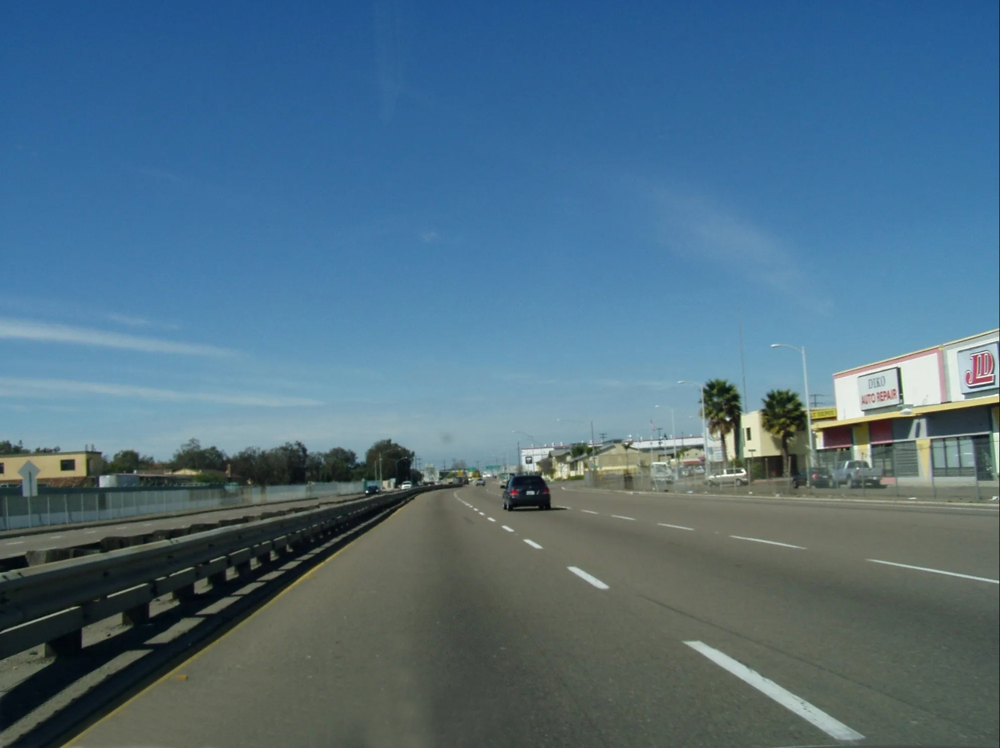
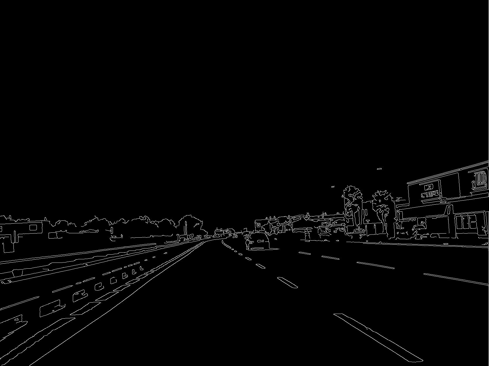
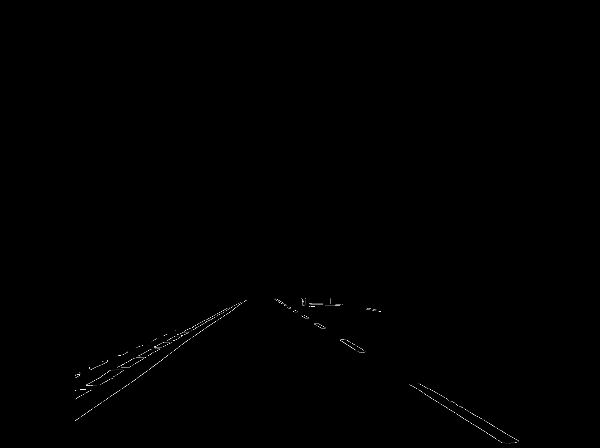
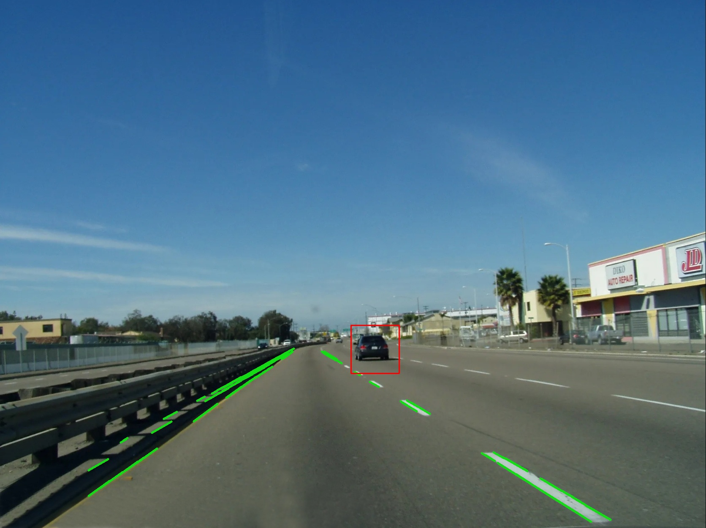

# Detect Road and Cars

A Python program that applies image processing techniques and object detection algorithms to detect roads and cars in an image or video.

## Description

This Python script uses the OpenCV library for image processing and object detection. The script follows these steps for every frame:

1. Image filtering: The image is transformed to grayscale and blurred using a Gaussian window. Then, edge detection is performed using the Canny edge detection method.

2. Line detection: The Hough Transform method is used for detecting lines in the image, representing the detected road.

3. Car detection: A pre-trained Cascade Classifier is used for detecting cars in the image.

The result is the original image overlayed with the detected lines (roads) and rectangles (cars).

## Requirements

- Python 3.6 or higher
- OpenCV (cv2)
- numpy

## Installation

1. Clone this repository:
    ```
    git clone <repo-link>
    ```
2. Navigate to the project directory:
    ```
    cd <directory-name>
    ```

3. Install required packages:
    ```
    pip install -r requirements.txt
    ```

## Usage

1. Run the script:
    ```
    python road_car_detection.py
    ```

    The script will open multiple windows showing the original image, edge detected image, masked edge image and final image with roads and cars detected.

2. Press any key to close the current image window and move to the next one.

## Configuration

The script can be configured by modifying the following parameters at the top of the script:

- **guassian_window:** size of the window used in the Gaussian blur process
- **max_slope:** maximum slope for a line to be considered a road
- **edge_low, edge_high:** thresholds for the Canny edge detection
- **mask_height:** factor to determine the height of the mask applied over the edge detected image
- **line_detection_rho, line_detection_theta, line_detection_threshold, line_detection_minLine, line_detection_maxGap:** parameters for the Hough Transform line detection
- **car_minsize:** minimum size for an object to be considered a car by the Cascade Classifier

Note: The 'cars.xml' file required for the Cascade Classifier should be in the same directory as the script. 

## Some Notes for Future Additions

Video support has been added recently and is still being tested. Note that due to immense processing for every frame, this program is able to crunch approximately 30 frames per second. If your video is anything above that, it's recommended to skip every Nth frame in order to downscale your video to allow for real-time processing. For example, if your video is 60FPS, it is recommended to skip every other frame since the result data loss when downscaling from a 60FPS to 30FPS video will be negligible. A future commit will automatically take care of downscaling.

This program uses a static, 6-vertice trapezoid-like mask. This means that shapes outside of this mask will not be considered when it comes to road line detection (vehicular detection is unaffected). This mask addition eliminates a significant amount of false detections. In future commits, logic to dynamically shape this mask according to road turns and inclines/declines will be added.

Currently, all the image processing parameters are fixed in accordance with bright, non-worn, clear road lines on fairly fark asphalt. A future commit will dynamically adapt these parameters to also conform to different, more poor road conditions.

## Example of Frame-by-Frame Image Processing

Original Car-Eye-View Image



Canny Edge Image



Canny Edge, masked Image



Final Resulting Image


## Contribution

Feel free to contribute to this project by opening issues or submitting pull requests.
