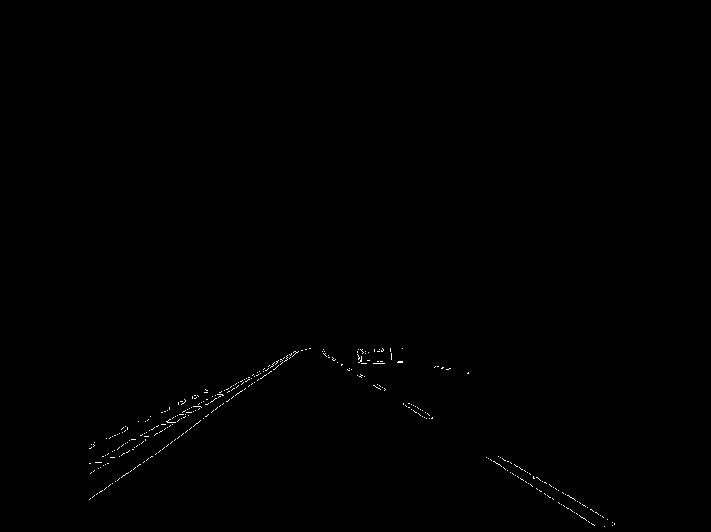

# Detect Road and Cars

A Python program that applies image processing techniques and object detection algorithms to detect roads and cars in an image.

## Description

This Python script uses the OpenCV library for image processing and object detection. The script follows these steps:

1. Image filtering: The image is transformed to grayscale and blurred using a Gaussian window. Then, edge detection is performed using the Canny edge detection method.

2. Line detection: The Hough Transform method is used for detecting lines in the image, representing the detected road.

3. Car detection: A pre-trained Cascade Classifier is used for detecting cars in the image.

The result is the original image overlayed with the detected lines (roads) and rectangles (cars).

## Requirements

- Python 3.6 or higher
- OpenCV (cv2)
- numpy

## Installation

1. Clone this repository:
    ```
    git clone <repo-link>
    ```
2. Navigate to the project directory:
    ```
    cd <directory-name>
    ```

3. Install required packages:
    ```
    pip install -r requirements.txt
    ```

## Usage

1. Run the script:
    ```
    python road_car_detection.py
    ```

    The script will open multiple windows showing the original image, edge detected image, masked edge image and final image with roads and cars detected.

2. Press any key to close the current image window and move to the next one.

## Configuration

The script can be configured by modifying the following parameters at the top of the script:

- **guassian_window:** size of the window used in the Gaussian blur process
- **max_slope:** maximum slope for a line to be considered a road
- **edge_low, edge_high:** thresholds for the Canny edge detection
- **mask_height:** factor to determine the height of the mask applied over the edge detected image
- **line_detection_rho, line_detection_theta, line_detection_threshold, line_detection_minLine, line_detection_maxGap:** parameters for the Hough Transform line detection
- **car_minsize:** minimum size for an object to be considered a car by the Cascade Classifier

Note: The 'cars.xml' file required for the Cascade Classifier should be in the same directory as the script. 

## Example

Original Car-Eye-View Image


Canny Edge Image



Canny Edge, masked Image


Final Resulting Image


## Contribution

Feel free to contribute to this project by opening issues or submitting pull requests.
